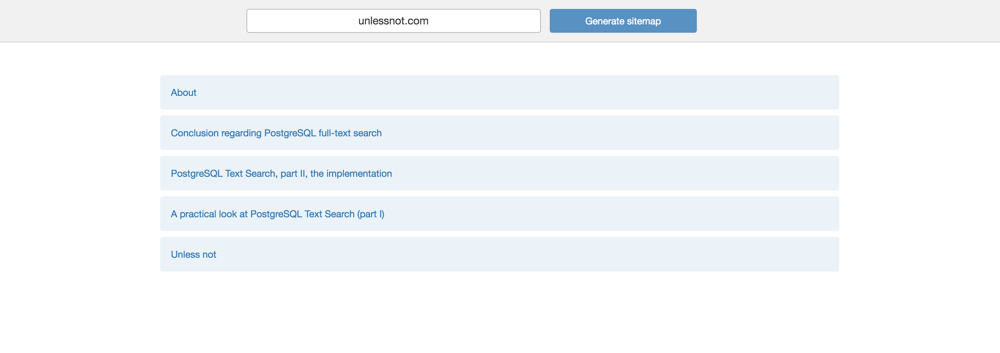

Crawlr
==========

A simple web crawler, which given a URL, outputs a sitemap with the assets links for each page within the same URL domain.

* Ruby 2.2.3+
* Rails 5.0.0
* Postgres 9.5+

Considerations
-

1. The most challenging part is to decide the depth of crawling. Depending on the website, it could be very expensive to crawl thru all the pages. In this product, it was chosen to go deeply unlimited, but ignoring some paths described on the robots.txt.
2. The approach to visit all links is based on iterating over the "unvisited" ones, requesting, parsing and saving the links and assets found into database. The process is done again until there is no more link to visit (crawl).
3. Performance is an important issue here. By requesting all the pages, we can overload the memory and depending on the machine, the application server (and browser) starts raising a lot of timeout errors. This product uses [Celluloid futures](https://github.com/celluloid/celluloid) to perform requests asyncronously, then later retrieves the results and parses accordingly. 
4. For the HTML parser, it was used [Nokogiri](http://www.nokogiri.org/), which is pretty fast for this kind of challenge.
5. While saving into database, as we are using Rails and ActiveRecord, by inserting one-by-one is quite impossible regarding performance. It's very slow and sometimes it freezes. To overcome this we simply make raw bulk inserts into databse using the ActiveRecord connection. 
6. According to the latest version of this product, it takes ~30 seconds to generate the sitemap for a website with 500 pages and 18k assets. 

Testing
-
```
# Running unit specs, ignores feature specs
-> bundle exec rspec -t ~js 

# Running feature specs only
-> bundle exec rspec -t js

# Happy TDD (it ignores feature specs)
-> bundle exec guard

```
#### Disclaimer on Testing 

Trying to run `rspec` will cause some assertion failures due to conflict with feature specs. That's why the importance of using the option `-t ~js` to ignore feature/js specs.

Usage
-
```
rails s
```



Author
-
@leandronsp
